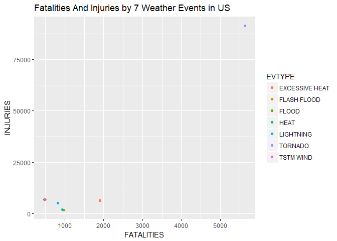
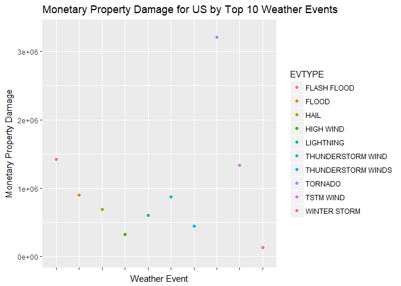

# Tornadoes Cause Most Damage to People and Property in the United States

#Synopsis
The weather event that is most harmful in relation to population health in the US is Tornadoes. It causes by far the most injuries and fatalities. The next most detrimental event is Excessive Heat, which produces slightly more fatalities than the cluster of the remaining 5 Events (Flash Flood, Flood, Heat, Lightning, Thunderstorm Wind).

The weather event that is most economically damaging is also Tornados, beating out the next closest event by about $ 1.5 million. The next two most damaging events are Flash Floods and TSTM Wind. If all Thunderstorm Wind categories are combined, they would contribute to the 2nd most Property Damaging Event.

Overall, the most damaging event in the US in relation to people and property damage is Tornadoes. 


#Data Processing
###Requirements to load data:
- R version 3.4.1
- data file named "repdata%2Fdata%2FStormData.csv.bz2" in your working directory


```r
library(ggplot2)

data <- read.csv("repdata%2Fdata%2FStormData.csv.bz2", header=TRUE, sep=",")
```

#Results Part 1 - Which EVTYPE (Event Type) is Most Harmful to Health?
This was interpreted as which Event Type creates the most fatalities and injuries.  

First, sum up total Fatalites by Event Type, and total Injuries by Event type.


```r
sumPeople <- aggregate(cbind(FATALITIES, INJURIES) ~ EVTYPE, data, sum)
```

Next, combine both data sets, sort FATALITIES for Top 5


```r
fatINJor <- sumPeople[order(sumPeople$FATALITIES, sumPeople$INJURIES),]
```

Top 5 Events for FATALITIES

```r
tail(fatINJor, n=5)
```

```
##             EVTYPE FATALITIES INJURIES
## 464      LIGHTNING        816     5230
## 275           HEAT        937     2100
## 153    FLASH FLOOD        978     1777
## 130 EXCESSIVE HEAT       1903     6525
## 834        TORNADO       5633    91346
```

Top 5 Events for INJURIES

```r
fatINJor <- sumPeople[order(sumPeople$INJURIES, sumPeople$FATALITIES),]
tail(fatINJor, n=5)
```

```
##             EVTYPE FATALITIES INJURIES
## 464      LIGHTNING        816     5230
## 130 EXCESSIVE HEAT       1903     6525
## 170          FLOOD        470     6789
## 856      TSTM WIND        504     6957
## 834        TORNADO       5633    91346
```

Subset original data to include Top 7 Event Types for BOTH Fatalites and Injuries, then find Total Fatalities and Injuries by Event Type

```r
topsev <- subset(data, data$EVTYPE == "TORNADO" | data$EVTYPE == "TSTM WIND" | data$EVTYPE == "FLOOD" | data$EVTYPE == "EXCESSIVE HEAT" | data$EVTYPE == "LIGHTNING" | data$EVTYPE == "FLASH FLOOD" | data$EVTYPE == "HEAT")
```

Find Totals for FATALITIES & INJURIES

```r
topsevTotal <- aggregate(cbind(FATALITIES, INJURIES)~EVTYPE, topsev, sum)
topsevTotal
```

```
##           EVTYPE FATALITIES INJURIES
## 1 EXCESSIVE HEAT       1903     6525
## 2    FLASH FLOOD        978     1777
## 3          FLOOD        470     6789
## 4           HEAT        937     2100
## 5      LIGHTNING        816     5230
## 6        TORNADO       5633    91346
## 7      TSTM WIND        504     6957
```

Plot Fatalities VS Injuries by Event Type

```r
library(ggplot2)
qplot(FATALITIES, INJURIES, data=topsevTotal, color=EVTYPE, main="Fatalities And Injuries by 7 Weather Events in US")
```

<!-- -->

```r
ggsave("people.png")
```

```
## Saving 7 x 5 in image
```

```r
dev.off()
```

```
## null device 
##           1
```


#Results Part 2 - Which EVTYPE (Event Type) Has Most Economic Consequences?
Sum up the Property Damage amounts by Event Type, and reorder

```r
damsum <- aggregate(PROPDMG ~ EVTYPE, data, sum)

damsum <- damsum[order(damsum$PROPDMG), ]
tail(damsum, n=10)
```

```
##                 EVTYPE   PROPDMG
## 972       WINTER STORM  132720.6
## 359          HIGH WIND  324731.6
## 786 THUNDERSTORM WINDS  446293.2
## 464          LIGHTNING  603351.8
## 244               HAIL  688693.4
## 760  THUNDERSTORM WIND  876844.2
## 170              FLOOD  899938.5
## 856          TSTM WIND 1335965.6
## 153        FLASH FLOOD 1420124.6
## 834            TORNADO 3212258.2
```
Subset top 10 Economically Damaging Events (> PROPDMG >= 13,000)


```r
damSumg13 <- subset(damsum, PROPDMG >=130000)
```

Plot Total Property Damage by Top 10 Weather Events


```r
g <- ggplot(damSumg13, aes(EVTYPE, PROPDMG))
g+geom_point(aes(color = EVTYPE))+
  theme(axis.text.x=element_blank())+      
  labs(x="Weather Event", y="Monetary Property Damage") + 
  ggtitle("Monetary Property Damage for US by Top 10 Weather Events")+
  ylim(c(0,3300000))
```

<!-- -->

```r
ggsave("money.png")
```

```
## Saving 7 x 5 in image
```

```r
dev.off()
```

```
## null device 
##           1
```

